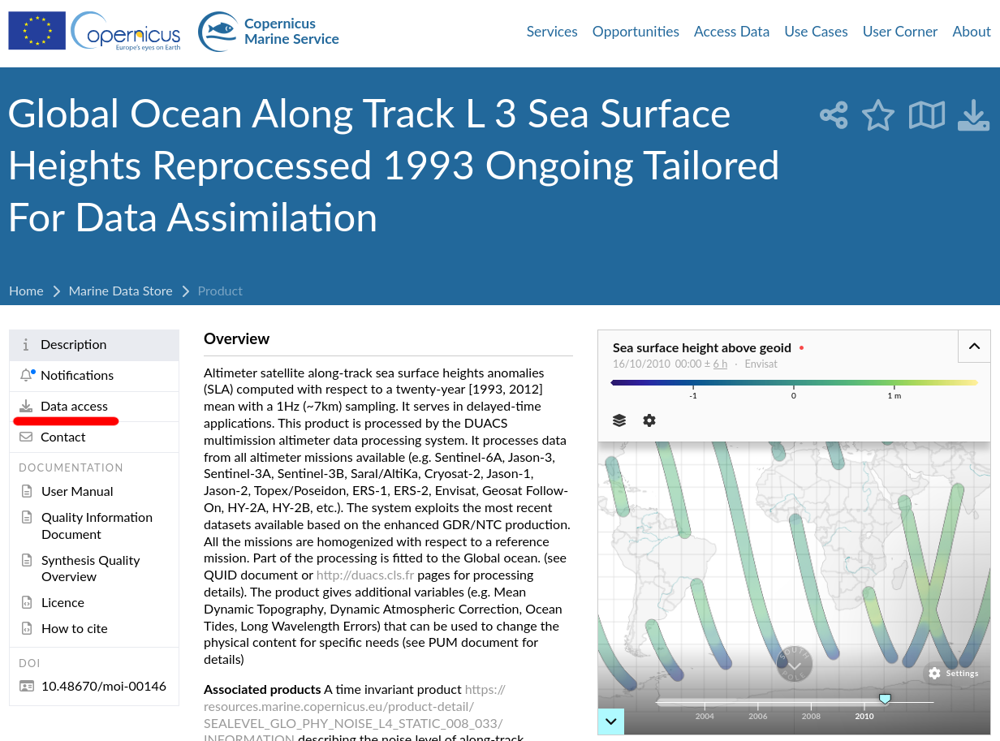
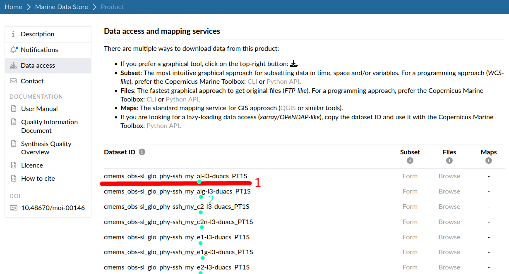

# CREATE YOUR OWN CONFIGURATION FILE

Configuration files help you keeping track of your different experiments, they are loaded in the python script very easily by specifying their full name *(without the .yaml extension)*.

For instance, `config/metrics/metrics_4dvar_2019.yaml` is executed by using the command:

`python main.py metrics=metrics_4dvar_2019`

## EVERY CONFIGURATION PARAMETER EXPLAINED

**`MODEL_TYPE`**:
The type of model you are evaluating, check in the [`config`](../config/) folder which model types have been implemented, markdown files contain information about the outputs formatting. [4DVARNET example](./4DVARNET.md).

**`paths.METRICS_PATH`**, **`paths.OSE_DATA_PATH`**, **`xp_name`**, **`data_name`**:
- Your data will be downloaded to: `OSE_DATA_PATH`/`data_name`/
- Your metrics will be stored in `METRICS_PATH`/`xp_name`/`data_name`/

**`paths.rec_path`**:
- Your model output folder with which metrics will be computed.

**`copernicus_dataset_id`**, **`ref_satellites`**
- The data will be downloaded using the **copernicusmarine** toolbox. It requires a `dataset_id` from on of the products found on the [Copernicus Marine Data Store](https://data.marine.copernicus.eu/products).

Here is a tutorial on how to find your `dataset_id` and `ref_satellites`

When you chose your ocean product, select Data Access on the left.

- your `dataset_id` will be the full name underlined in ***1***, and `ref_satellites` is a list of satellites which names are located on ***2***.
> IMPORTANT: in the `dataset_id`, replace the name of the satellite by a double bracket: `{}`.

- In this example, the `dataset_id` is: `cmems_obs-sl_glo_phy-ssh_my_{}-l3-duacs_PT1S`
- In this example, `ref_satellites` are: `[al, lag, c2, c2n, e1, e1g, e2]`

**`specs.min/max_lon/lat`**:
- latitude and longitude slices to download

**`specs.min/max_time`**, **`time_day_crop`**:
- time slice to download and on which to compute metrics
- `time_day_crop` number of days to crop at the start and the end of the slice before evaluating

**`metrics_spatial_domains`**:
- dict of domains of latitude and longitude slices over which metrics will be computed

**`options.skip`**:
- The data downloading step, or the metrics computing step can be skipped. If the data has already been downloaded, or the metrics have already been computed, they will be skipped anyway.

**`options.overwrite`**:
- The downloaded data will be re-downloaded, regardless of if it has already been downloaded. Metrics will be re-computed.
